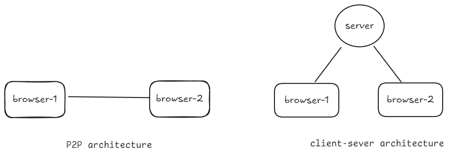
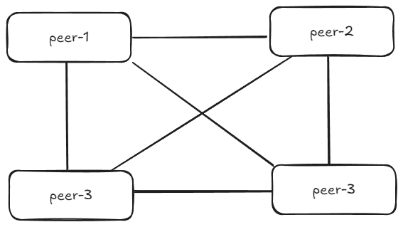

## Table of Contents

- [why?](#webRTC)
- [webRTC Architecture - P2P](#webrtc-architecture---p2p)
- [Signaling server](#signaling-server)
- [STUN (Session Traversal Utilities for NAT)](#stun-session-traversal-utilities-for-nat)
  - [NAT - Network Address Translation](#nat---network-address-translation)
- [ICE (Interactive Connectivity Establishment) candidates](#ice-interactive-connectivity-establishment-candidates)
- [TURN server](#turn-server)
- [Offer](#offer)
- [Answer](#answer)
- [SDP (Session description protocol)](#sdp-session-description-protocol)
- [RTCPeerConnection object in browser](#rtcpeerconnection-object-in-browser)
- [Multi client Architectures and Scaling WebRTC](#other-architectures-and-scaling-webrtc)
  - [Limitations of P2P Architecture](#limitations-of-p2p-architecture)
  - [SFU (Selective Forwarding Unit)](#sfu-selective-forwarding-unit)
  - [MCU (Multipoint control Unit)](#mcu-multipoint-control-unit)
  - [Distributed SFU](#distributed-sfu)
- [Adhoc](#adhoc)
  - [Transcoding on the Fly](#transcoding-on-the-fly)
  - [Is SFT a TURN server](#is-sft-a-turn-server)

# webRTC

why?

- webRTC is the core/only protocol that lets you do real-time media communication from inside a browser
- sub-second latency
- 30FPS games

> NOTE: cricket matches, Youtube live streaming does not use webRTC.
> They use `HLS` - why because there 2-5 second delay is not a problem

## webRTC Architecture - P2P

webRTC is a peer to peer protocol. That means that you can directly send your media over to other person without the need of a central server (but there is a catch)



- relaying video through a server is very expensive
- for webRTC we do need a central server for signaling and sometimes for sending media as well (TURN server)

> **IP Leaks:**  
> When peers connect directly, each peer's IP address is exposed to the other. This can result in user IP leakage.

## Signaling server

Both the browser need to exchange their address before they can start taking to each other. A signaling server is used for this purpose


- Initially info exchange is usually done through websocket connection, but can be anything(http)
- One the IPs have been exchanged, we don't need the central server anymore. Communication can happen P2P

## STUN (Session Traversal Utilities for NAT)

### NAT - Network Address Translation

- There are limited IPs in the world (that's why we have common public IPs for hotels, hostels, college etc.)
- Because of this webRTC discovery becomes difficult
  i.e. when peer-1 tries to connect to another peer-2, peer-1 sees the public IP peer-2 not the actual IP address of peer-2

STUN solves the problem of webRTC discovery


Google has a free STUN server : [link](https://webrtc.github.io/samples/src/content/peerconnection/trickle-ice/) - useful for debugging webRTC peers

## ICE (Interactive Connectivity Establishment) candidates

- Bunch of `IP:Port` from which traffic can reach you over a network
- IF two people try to connect to each other in a `hotel-Wifi`, they can connect via their private router ICE candidate
- If two people from different countries are trying to connect to each other, they would connect using their public IPs

## TURN server

- Depending upon the Types of NAT the strictness can vary,
  i.e. can traffic to come from other places rather than from those client who opened a connection in NAT
- When we get an IP from the STUN server, The browser sometimes expect the data to come from the STUN server and blocks the data coming from other browser


- TURN server gives us extra ICE candidates
- TURN is an optional fallback if we cannot directly connect (P2P), in such case the data will be routed trough the TURN server

## Offer

The process of first browser (the one initiating connection) sending their ICE candidates to the other side

## Answer

The other side returning their ICE candidates is called the answer

## SDP (Session description protocol)

A single file that contains all your,

1. ICE candidates
2. what media you want to send, what protocol you have used to encode the media etc.

This is the file that is send in the `Offer` and `Answer`


<br> <br>

# RTCPeerConnection object in browser

This object helps in establishing a webRTC connection and hides the protocol level implementation

```js
const pc = new RTCPeerConnection();
```

debugging - visit `chrome://webrtc-internals/` to see the active `RTCPeerConnection` objects and their stats

once we create a peer connection we need to create an `offer`, which is required for initiating a connection

```js
const offer = await pc.createOffer();

pc.setLocalDescription(offer);
//note: this we need to manually set the `offer` `SDP`
```

- from here browser-1 sends the `offer` `SDP` to brower-2 through `signaling server`
- browser-2 sets the its `remote description` as `offer`
- browser-2 creates an `answer` `SDP`

```js
const answer = pc2.createAnswer();
pc2.setRemoteDescription(answer);
```

- browser-2 sets the `answer` as the `local description`
- browser-2 sends the `answer` `SDP` to browser-1 via `singaling server`
- browser-1 sets its `remote description` as `answer`


This is just to establish a connection

To do video call

- we need to have mic/camera permission
- get audio and video `stream`
- call `addTrack` on `pc`
- this would trigger an `onTrack` callback on the other side

# Multi client Architectures and Scaling WebRTC

**Limitations of P2P Architecture**

- P2P architecture is best for 1-1 video call/interactions.
- for a group call or interaction between `n` peers (`n > 2`). It has some bottlenecks

  

- Here we need to send the same stream to all other peers which will consume lot of network bandwidth and system resources on a peer
- For n peers we need to send (n-1) streams

There are two other popular architectures for doing webRTC

1. SFU
2. MCU

## SFU (Selective Forwarding Unit)

As the name suggest, its a system that takes in streams from multiple client and selectively forward the packets to other clients depending on some criteria


- Lets assume all the browser in the above diagram are in a group call and brower-3 mutes browser-1
- Here Browser-1 only send a single stream to the SFU server, which selectively forward that stream to other clients in the call
- This frees up browser-1 from the responsibility of sending the streams to all parties and frees up browser-3 from handing unwanted stream

> SFU only forwards packet - it does not decode them

We can use STU to,

- Cut a video stream going to a client
- Send optimal bitrate stream to a client (Simulcast)
- Receives video in a paginated manner

Limitations of SFU

- we can paginate video
- but we cannot paginate audio, we need to hear the person speaking even if they are not visible on the current page


- if we forward all the audio streams to a client event if the speaking party is not visible on the screen, we will need to handle large number of audio streams and there would be cracking if the CPU is not able to handle it
- and also this is resource intensive

## MCU (Multipoint control Unit)

It mixes audio/video together on the server before forwarding it.
This means it need to

```bash
stream -> decode_video/audio -> mix -> re-encode -> stream
```

for encode/decode we can use `FFmpeg`


problem:

- If I am speaking and get back the merged audio with my audio in it, there could be a echo feeling
- there can be a cracking sound if we mix all the audio streams - because of noise and how it adds up

fix:
- So we limit the mix to have 3 loudest audio,
- And we create 4 version of the mix,
  1.  audio mix of all 3 person speaking
  2.  audio mix of person1 and person2
  3.  audio mix of person2 and person3
  4.  audio mix of person3 and person1
- we forward the full mix to all users who are not the loudest speaker
- we forward the partial mix excusing their own voice to the loudest speakers

> MCU is mostly used to merge audio and not video
>
> - we don't want to send a pre-processed video stream with layout to the end user
> - But incase of an audio we need to hear the person speaking even if they are not currently visible on the paginated video streams

Applications

- cloud recording - meeting recording
- Mixing streams and live
  ![[cloud recording and live streming architecture using SFU and mixer|1024]]
- mixer mixed the stream and create a recording of the session
- `RTMP` protocol is not any more used for delivery as it way used to deliver video to adobe flash. But it is widely used for video ingestion from source to server.
- Form there we convert video to HLS segments, as it is HTTP friendly can can be cached in CND and distributed across the world easily

## Distributed SFU

Scaling conference to handle 1000+ participants


- Architecture of platform like Unacademy where a class can have 1000+ students
- Students many want to see the teacher stream and students can interact with teacher up on permission

# Adhoc

## Transcoding on the Fly

How does platform like google meet and zoom change video quality when a user is pinned and their video frame size is large compared to other participants

TLDR: `Simulcast`


- browser1 send multiple video streams of various quality to the SFU,
- SFU selectively forward optimal stream to browser2 based on a state

why not transcode on the SFU?

- remember: SFU does cannot/will not decode a stream
- if we do, SFU want to decode all the high quality stream coming form all the browsers which can be a really big burden
- Instead we give the responsibility of sending transcoded stream to browser
- And modern browsers can easily send multiple bitrate video for webRTC natively

## Is SFT a TURN server

short answer NO
- SFU runs application like mediasoup
- TURN server uses turn protocol and runs something like `coTurn`

TURN server is required in case of a browser cannot directly communicate with SFU server


